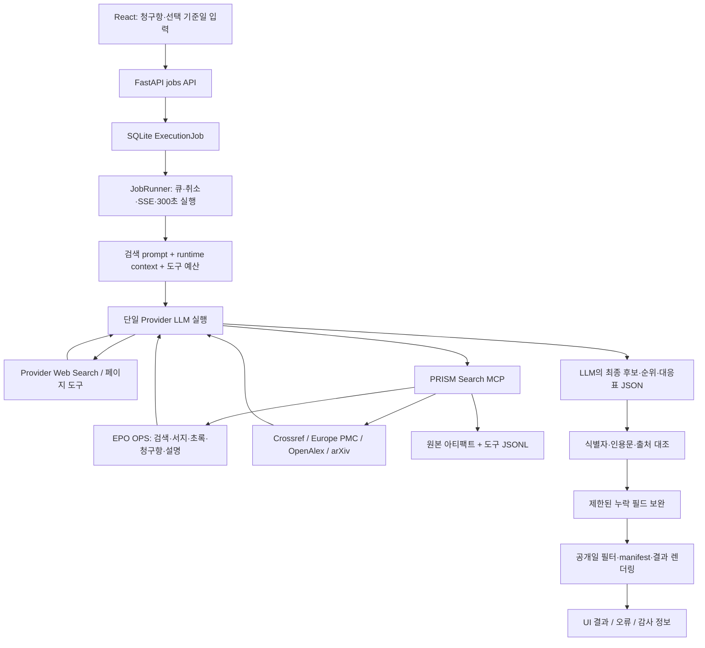
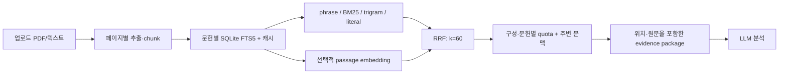
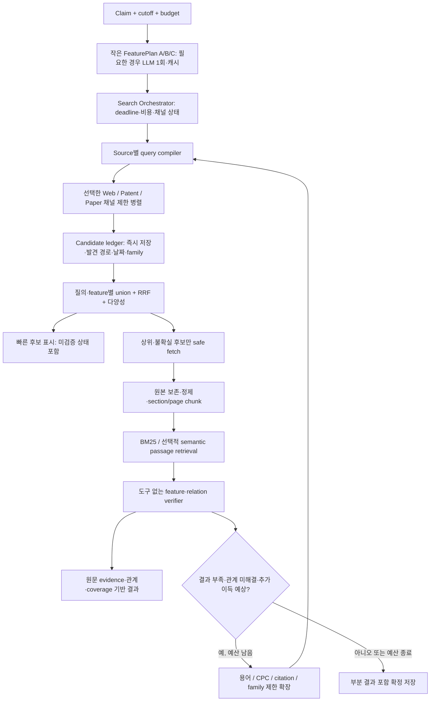

# PRISM 검색 품질·아키텍처 진단 보고서

작성일: 2026-09-16 · 대상: D:/PRISM · 기준 커밋: d66c40d · 단계: 구현 전 진단

## 1. 결론과 판단 범위

**검색 서브시스템을 단계적으로 재구축하는 것이 가장 적절하다.** React UI, FastAPI API, SQLite 작업 관리, Provider 실행기, 특허 API 어댑터, 원문 아티팩트·출처 검증, 로컬 문헌 검색은 재사용한다. 외부 검색의 query planning, candidate 수집·보존, 검색 종료, ranking, 전문 passage 연결은 애플리케이션이 통제하는 검색 엔진으로 옮긴다.

가장 먼저 필요한 것은 새 embedding 모델이나 더 큰 LLM이 아니다. **작동하는 검색 채널, 짧은 feature 질의, 후보를 즉시 보존하는 구조, 시간 기준 종료, 전문 내부 검색과 관계 검증**이다.

판단을 뒷받침하는 관측은 다음과 같다.

- 현재 기본 실행 경로로 Gaussian 청구항을 검색했으나 **300.57초 후 시간 초과, 최종 후보 0건**이었다. 성공한 API 검색 응답에는 36개 행·35개 고유 문헌이 있었지만, 최종 후보로 이어지지 않았다.
- 현재 실행 환경에는 pyalex와 arxiv가 없다. 채널 상태는 사용 가능으로 표시되지만 실제 논문 검색 두 경로가 실패했다.
- 같은 청구항의 희소 feature를 분리한 조사용 Web Search는 **질의당 약 1.5–1.8초**에 A 관련 원고 단서와 B 관련 GauHuman을 찾았다. 전체 청구항 질의의 반환 결과에서는 두 단서를 찾지 못했다.
- 현재 EPO API도 전문 검색을 지원한다. A의 동일 단어 조합은 title/abstract에서 0건, full text에서 813건이었다. 다만 무작정 전문 범위를 넓히면 노이즈와 첫 페이지 편향이 커졌다.
- 기존 로컬 BM25에 여러 단어를 하나의 문자열로 전달하면 phrase로 처리된다. GauHuman 전문에서 “Gaussian distance cloning”은 0건, 단어 배열은 20개 passage를 반환했다.
- 동일한 소규모 관계 검증에서 전문 대신 검색한 passage를 입력했을 때 분류 결과가 같았고, **관측 input token 58.3%, latency 36.3% 감소**했다. 각각 1회이므로 일반 성능 향상을 확정하는 수치는 아니다.

**아직 증명하지 않은 것:** 개선 시스템의 전체 Recall@K, embedding 성능, 통계적 latency 개선, 청구항 A+B를 한 문헌이 모두 개시한다는 판단. 새 시스템을 구현하지 않았고, 아래 실험은 현재 시스템과 구성요소 대안을 비교한 것이다.

## 2. 조사 범위와 재현 조건

전체 파일 목록과 주요 의존 관계를 확인하고 실행 경로, 검색·문헌 처리, Provider, DB/API/UI, 설정, 평가 코드, 관련 테스트·문서를 추적했다. backend/app Python 98개 파일 약 32,632줄, backend/tests Python 68개 파일 약 23,839줄, frontend/src TS/TSX 35개 파일 약 9,939줄 규모다. 모든 줄을 동등한 깊이로 감사했다는 의미는 아니다. 현재 실행 코드와 실험을 우선했고, 과거 설계 문서를 현재 구현으로 간주하지 않았다.

실험 조건:

| 항목 | 조건 |
|---|---|
| 실제 baseline | 기존 JobRunner와 저장된 search prompt·기본 설정 사용 |
| Provider | agy, CLI 1.2.4, model 명시값 없음 |
| 입력 | 사용자가 제시한 Gaussian A/B 청구항 |
| 기준일 | 미지정. 검색된 문헌의 날짜를 기록하되 적격 선행기술로 단정하지 않음 |
| 실행 환경 | 기존 backend/.venv; 의존성 설치·설정 변경 안 함 |
| 외부 비교 | 기존 EPO/Literature 어댑터, 별도 조사용 Web Search, OpenAlex 직접 HTTP |
| 전문 비교 | 실제 GauHuman PDF를 기존 로컬 extraction/index/search에 입력 |
| 관계 검증 | 같은 Provider, 외부 도구 없는 실행; 합성 사례 4개 + 실제 문헌 1개 |
| 변경 범위 | 이 보고서와 진단 산출물만 생성. 제품 코드 변경 없음 |

실제 baseline은 HTTP/UI를 클릭한 E2E 테스트가 아니라, 기존 API가 만드는 것과 같은 종류의 작업을 생성해 **실제 실행기와 외부 도구를 호출한 통합 실행**이다. 정상 실행 아티팩트와 작업 이력 1개가 생성됐다. 현재 로컬 DB의 과거 유사검색 이력은 3개뿐이므로 성공률 통계로 사용하지 않았다.

관측값·스크립트·원문 해시는 [실험 요약 JSON](C:/Users/Administrator/AppData/Local/PRISM/diagnostics/20260916/experiment_summary.json)에 보존했다.

## 3. 현재 아키텍처와 data flow

### 3.1 외부 유사문헌 검색



현재 외부 검색에서는 LLM이 분해, 번역, query 생성, source 선택, 확장, 후보 선택, ranking, 종료를 모두 판단한다. 코드가 source 결과 전체를 통합한 candidate pool을 관리하거나, BM25/cosine/coverage 점수를 단계별로 산출하지 않는다.

핵심 경로는 [jobs._create_search_job](D:/PRISM/backend/app/api/jobs.py:571), [assemble_job](D:/PRISM/backend/app/job_assembly.py:541), [JobRunner._run_inner](D:/PRISM/backend/app/execution/runner.py:342), [검색 runtime context](D:/PRISM/backend/app/config.py:130)다.

### 3.2 업로드 문헌 분석의 로컬 검색 — 위 경로와 별개



이미 구현된 로컬 검색은 유용하다. 하지만 외부 검색으로 발견한 특허·논문을 이 파이프라인에 자동 연결하는 통합 경로가 부족하다. **“프로젝트에 BM25/embedding이 있다”와 “외부 특허 검색에 사용된다”는 다른 사실**이다.

### 3.3 요청 항목별 현재 상태

| 항목 | 코드에서 확인한 상태 |
|---|---|
| Patent API | EPO OPS 실구현 |
| Academic API | Crossref, Europe PMC, OpenAlex, arXiv 경로 존재. 설치 상태와 별개 |
| Web Search | Provider 내장 도구. 결과·페이지 관측 가능 범위가 Provider별로 다름 |
| Query generation | 검색 prompt의 LLM 판단. 안정된 planner 출력 계약·버전별 평가 없음 |
| Lexical/BM25 | 외부는 source 검색 문법; 로컬 문헌은 FTS5 |
| Embedding | 로컬 passage용 선택 기능. 현재 비활성 및 패키지 미설치 |
| Embedding model | paraphrase-multilingual-MiniLM-L12-v2, revision 고정 |
| Similarity | 로컬 semantic channel에서 query별 cosine의 최댓값; RRF 통합 |
| Threshold | 외부 검색에 코드화된 cosine threshold 없음. 로컬 semantic도 일괄 cosine cutoff 없음 |
| Top-K | MCP 검색 요청 최대 20개/페이지; 로컬 channel 기본 20, search_document 기본 8, 설정의 문헌별 evidence hit 기본 6 |
| IPC/CPC | EPO 검색·metadata에 존재. 외부 LLM이 사용을 결정; 체계적 soft reranker 없음 |
| Full text | EPO claims/description 가능. 논문 어댑터는 abstract/biblio 중심; Web fetch는 Provider 의존 |
| Parsing | EPO 다국어 title/abstract/claims/description, 문헌번호·분류·family ID 등; 로컬 PDF는 페이지/chunk |
| Reranking | 외부 LLM 판단; 로컬 RRF. 전용 cross-encoder/학습 ranking 없음 |
| Citation/family | OpenAlex cites_doi 옵션, EPO family ID 존재. 자동 특허 citation graph/안정된 family 그룹화 없음 |
| DB/cache | SQLite 작업·설정, 검색 원문 content hash 저장, 도구 journal, 로컬 index/embedding cache |
| 비동기/병렬 | 실행기는 async·Provider semaphore. 문헌 어댑터 내부의 source 호출은 순차적 |
| 실패 fallback | source 전환을 LLM에 요청; bounded field completion; timeout 시 fetch 자료 일부 보존 |
| 평가 | 도구 사용·출처·실행 완결성 평가가 중심. retrieval relevance gold set/Recall 평가 아님 |

Embedding 구현과 기본값: [semantic.py](D:/PRISM/backend/app/retrieval/semantic.py:30), [search_document](D:/PRISM/backend/app/retrieval/search.py:185), [기본 설정](D:/PRISM/backend/app/config.py:384). EPO의 구조화 query schema는 [search_mcp_server.py](D:/PRISM/backend/app/search_mcp_server.py:399), parsing은 [epo_parser.py](D:/PRISM/backend/app/patent_search/epo_parser.py:71)를 근거로 한다.

## 4. 실제 검색 실패 재현

실행 ID: ac410f86-5b00-4bc8-861b-1f01d5525624.

| 단계 | 관측 |
|---|---|
| Claim 입력 | 사용자 A/B 원문, cutoff 없음 |
| Query generation | LLM이 Gaussian/SVD/covariance 및 Gaussian splatting 등으로 질의 |
| 채널 상태 | web/EPO/literature 사용 가능으로 표시 |
| 논문 검색 1 | 기본 복합 검색 중 pyalex 미설치로 실패 |
| 논문 검색 2 | arXiv 경로에서 arxiv 미설치로 실패 |
| 논문 fallback | crossref_epmc 지정: 10행. 초록 보유 2행, 보충자료 등의 잡음 포함 |
| EPO 검색 1 | ta all “Gaussian SVD covariance”: 6행/총 6 |
| EPO 검색 2 | ta all “Gaussian SVD”: 10행/총 66 |
| EPO 검색 3 | ta all “Gaussian splatting”: 10행/총 90 |
| Web Search | 23회 호출. native stream에 모든 hit 목록이 구조화돼 있지 않아 후보 수 산정 불가 |
| API 후보 발견량 | 성공한 검색 응답 36행, 문헌 식별자 기준 35개 |
| Candidate filtering/ranking | LLM 내부 판단. 후보별 탈락 사유·중간 score 없음 |
| Embedding/threshold | 이 실행 경로에 없음. 이 단계에서 탈락했다고 볼 근거 없음 |
| 상세 조회 | EPO abstract 1건: CN111340119A, Gaussian mixture parameter 초기화 관련 |
| 최종 결과 | 300.57초 TIMED_OUT, 최종 JSON 파싱 불가, reported/verified 후보 0 |
| 실패 시 보존 | fetch metadata 1개만 보존. 전체 검색 hit가 재사용 가능한 후보 목록으로 남지 않음 |

도구 합계 41회: search_web 23, view_file 10, capabilities 1, literature_search 3, epo_search 3, epo_fetch 1. 원문 웹 페이지를 가져오는 read_url_content 호출은 이 실행에서 관측되지 않았다.

따라서 이 사례의 실패는 **“문헌이 없다”가 아니라 “검색·도구 실패·탐색 반복 후 결과를 완성하지 못함”**이다. Web Search에서 좋은 문헌이 실제 반환됐는지까지는 현재 native 로그만으로 확정할 수 없다. 로그에 보이지 않는 문헌을 “반환 후 제거됐다”고 추정하지 않았다.

[baseline 결과](C:/Users/Administrator/AppData/Local/PRISM/diagnostics/20260916/baseline_summary.json), [manifest](C:/Users/Administrator/AppData/Local/PRISM/diagnostics/20260916/baseline_manifest.json), [재현 스크립트](C:/Users/Administrator/AppData/Local/PRISM/diagnostics/20260916/run_baseline.py).

## 5. 코드 근거로 확인한 병목

| 우선순위 | 파일·함수 | 문제와 영향 |
|---|---|---|
| P0 | [search_channels.availability](D:/PRISM/backend/app/search_channels.py:133) | 설정/등록 중심 상태이며 web은 available을 기본 선언. pyalex/arxiv import 실패를 실제 가용성에 반영하지 못함 |
| P0 | [LiteratureBackend.search](D:/PRISM/backend/app/patent_search/literature_backend.py:243) | source를 순차 실행하고 LiteratureError만 격리. ModuleNotFoundError가 밖으로 전파돼 앞서 얻은 다른 source 결과도 응답으로 못 돌려줌 |
| P0 | [execution_limits](D:/PRISM/backend/app/search_channels.py:227), [runner](D:/PRISM/backend/app/execution/runner.py:370) | 신규 검색을 deep, 80회/300초로 고정. 입력 난이도·강한 후보 발견 여부에 따른 단계별 예산 아님 |
| P0 | [budget_status](D:/PRISM/backend/app/search_budget.py:7) | 76회에서 정리하도록 하나 wall-clock 잔여 시간을 고려하지 않음. 41회 시점에도 시간은 소진될 수 있음 |
| P0 | [retained_records](D:/PRISM/backend/app/search_budget.py:25) | 성공한 *_fetch만 보존. *_search의 후보 pool과 native web hit는 회복 대상에서 빠짐 |
| P0 | [agy_stream](D:/PRISM/backend/app/providers/agy_stream.py:349) | streamed step usage로 state.usage를 덮어씀. timeout에서 마지막 step만 DB에 남아 실행 전체 사용량을 표현하지 못함 |
| P1 | [SEARCH_RUNTIME_CONTEXT](D:/PRISM/backend/app/config.py:145) | query·도구·확장·종료·후보·순위·대응을 모두 LLM이 판단하며 PRISM이 독립 검색·기술 점수를 만들지 않도록 명시 |
| P1 | [SearchTools._record 변환](D:/PRISM/backend/app/search_mcp_server.py:349) | compact field 1,200자, detail field 40,000자. 절단은 표시하지만 이후 위치별 passage 조회가 없음 |
| P1 | [search_bm25](D:/PRISM/backend/app/retrieval/index.py:296) | 배열의 각 원소를 통째로 quoted prefix phrase로 처리. “문장 질의”와 “단어 목록” 계약 차이가 실제 0건을 만듦 |
| P1 | [epo_search_advice](D:/PRISM/backend/app/search_mcp_server.py:75) | broad query/첫 페이지의 한계는 경고하지만 이를 자동 해결하는 계획·예산·후보 합집합 없음 |
| P1 | [plain_query](D:/PRISM/backend/app/patent_search/literature_client.py:180) | 논문 일반 query에서 quote/Boolean 표현 등을 정리하고 최대 24개 term 사용. source별 phrase/Boolean 기능을 동일하게 기대하면 안 됨 |
| P1 | [verify](D:/PRISM/backend/app/search_verification.py:86) | 식별자·출처와 실제 인용문 포함 여부 검증. 인용문이 해당 기술 관계를 함의하는지까지 검사하는 함수가 아님 |
| P1 | [EPO fields](D:/PRISM/backend/app/patent_search/epo_parser.py:81), [compact response](D:/PRISM/backend/app/search_mcp_server.py:354) | family_id는 parser에 있지만 compact 선택 필드에서 제외. 문헌번호 dedup과 family dedup은 별개 |
| P2 | [search_quality.assess](D:/PRISM/backend/app/search_quality.py:45) | 오류 문자열에 limit이 있으면 quota 소진으로 분류. 오류에 붙은 budget.limit까지 읽어 미설치 오류를 한도 소진으로 오분류한 실행 증거 존재 |
| P2 | [probe_search_recall.py](D:/PRISM/backend/scripts/probe_search_recall.py:18) | 현재 없는 app.search_recall을 import. --help부터 실패하여 실행 가능한 recall 평가 도구가 아님 |

현재 후속 보완은 [search_followup.py](D:/PRISM/backend/app/search_followup.py:18)에 이미 제한돼 있다. 최대 4개 미조회 필드, 약 30초 metadata 보완, 최대 2개 quote repair를 다룬다. **과거 문서에 있던 대규모 재검색/재분석을 현재도 매번 실행한다고 진단하지 않았다.** 이 bounded 보완 자체는 재사용 가치가 있다.

### 비용 계측의 구체적 문제

이번 실행 DB usage는 input 5,812 / output 163 / cache_read 101,911이다. 그러나 stdout의 서로 다른 41개 step_index usage를 합치면 input **420,302**, output **10,397**, cache_read **1,922,708**이다.

이 합계는 **관측 stream 집계이며 청구서상의 billed token이 아니다.** Provider별 input/cache/thinking의 포함 관계를 확인해야 하고, thinking을 output에 다시 더해 비용을 계산해서는 안 된다. 모델 식별자·요금·최종 청구값이 없으므로 달러 비용을 만들지 않았다. 적어도 현재 timeout 사용량을 실행 전체 비용으로 표시해서는 안 된다. [usage audit](C:/Users/Administrator/AppData/Local/PRISM/diagnostics/20260916/usage_audit.json).

### 기존 테스트 확인

검색·budget recovery·field completion·semantic·EPO 관련 선택 테스트: **192 passed / 6 failed / 7 skipped, 2.47초**.

- 3개 실패: 예전 40/36 호출 예산 기대와 현재 80/76 정책 불일치.
- 3개 실패: 테스트 준비 단계에서 optional huggingface_hub 미설치.
- 7개 skipped: optional semantic 관련 등.

이 수치를 전체 테스트 통과로 표현하지 않는다. 테스트 자산이 상당히 있으므로 “전체를 새로 만들어야 할 만큼 테스트 불가능”한 repository도 아니다.

## 6. 동일 청구항의 대안 검색 실험

### 6.1 Web Search: 전체 문장 대 feature 분리

다음은 **별도 조사용 Web Search 도구**의 각 요청 elapsed time이다. 현재 agy 엔진과 검색 공급자·캐시가 동일하다고 보장할 수 없어 300초 baseline과 직접적인 배수 성능 비교를 하지 않는다.

| 질의 | 시간 | 관측한 유력 단서 |
|---|---:|---|
| 전체 A+B 영문 문장 | 1.681초 | 반환 텍스트에서 IBGS·GauHuman 없음 |
| “Gaussian” “neighbor” “covariance” “SVD” | 1.539초 | A 관련 OpenReview 원고 |
| “Gaussian splatting” “distance” “cloning” | 1.762초 | GauHuman 공식 CVPR PDF |
| “Gaussian splatting” “KL divergence” “clone” | 1.524초 | GauHuman 재발견, mirror 중복도 증가 |

마지막 질의는 seed를 읽은 뒤 얻은 terminology 확장이다. 숨겨둔 정답을 모르는 초기 질의와 동일하게 취급하지 않는다. 단서 2개가 사후 발견됐으므로 이 표를 Recall=100%나 공식 MRR로 환산하지 않는다.

**해석:** 희소한 A와 관계 중심 B를 나눠 검색하는 효용은 이 사례에서 관측됐다. 단어 수를 늘리는 확장 자체가 추가 relevant family를 늘린다는 증거는 없다. Web만 쓰면 index 누락, 노출 순위, mirror 중복, 원문 차단으로 recall이 제한된다. [원시 비교 결과](C:/Users/Administrator/AppData/Local/PRISM/diagnostics/20260916/web_trials.json).

### 6.2 현재 EPO API: abstract 대 full text, 확장·분류

아래 all은 term 내부 단어의 conjunction이다. 반환 순서는 provider default이며 relevance 정렬을 요청한 것이 아니다.

| Query | 범위 | 반환/전체 | 시간 |
|---|---|---:|---:|
| Gaussian neighbor covariance SVD cloning | ta | 0/0 | 1.965초 |
| Gaussian neighbor covariance SVD | ta | 0/0 | 0.973초 |
| Gaussian neighbor covariance SVD | txt | 20/813 | 2.650초 |
| Gaussian distance cloning | ta | 0/0 | 1.528초 |
| Gaussian distance cloning | txt | 20/4,050 | 2.810초 |
| Gaussian AND (SVD OR singular value decomposition) AND (neighbor OR adjacent) | txt | 20/12,698 | 3.398초 |
| Gaussian SVD AND CPC G06T17/20 | txt + CPC branch | 20/84 | 4.395초 |

A/B 전체 단어의 ta 결과 0건은 전문 부재가 아니다. txt의 첫 페이지에는 의료·제조·마케팅 등 잡음이 많았고, 날짜도 최신 구간에 몰렸다. A의 20/813, B의 20/4,050은 **조회한 페이지 비율일 뿐 recall이 아니다.**

CPC branch에서는 **8번째에 US20250391110A1, Wireframe generation via gaussian splatting**을 얻었다. 별도로 발견한 WO2025264424A1과 EPO family_id=96698520으로 연결됐다. 해당 family의 발견 여부만 보면 K=5에서는 놓치고 K=10에서는 남는다. 이 branch는 seed 관련 분류를 사용했으므로 초기 검색 전체에 CPC hard filter를 적용해야 한다는 증거는 아니다.

**해석:** ta와 txt를 선택적으로 병행하고, 관련 seed를 찾으면 분류를 별도 discovery branch로 쓰는 것이 유망하다. 모든 문헌에 하나의 CPC를 강제하거나 모든 broad query의 페이지를 끝까지 읽는 방식은 권하지 않는다.

[API 질의 실험](C:/Users/Administrator/AppData/Local/PRISM/diagnostics/20260916/channels/summary.jsonl), [CPC 실험](C:/Users/Administrator/AppData/Local/PRISM/diagnostics/20260916/seed/cpc_soft_branch.json).

### 6.3 논문 API

| 방식 | 시간 | 결과와 한계 |
|---|---:|---|
| 기존 default literature | baseline 내부 | pyalex 미설치 예외 |
| 기존 arXiv | baseline 내부 | arxiv 미설치 예외 |
| Crossref+Europe PMC, A+B terms | 5.521초 | 12행, GauHuman 단서 없음 |
| 같은 source, Gaussian distance cloning | 4.921초 | 20행, 양자·유전자 cloning 등 잡음 |
| 같은 source, Gaussian splatting KL divergence cloning | 3.045초 | 11행, 관련 분야는 늘지만 GauHuman은 해당 반환분에 없음 |
| OpenAlex 직접 HTTP, A+B terms | 1.475초 | 10/125, 통계·생물학 문헌 다수 |
| OpenAlex 직접 HTTP, Gaussian splatting distance cloning | 0.598초 | 10/400, 3DGS 분야 후보 있으나 GauHuman은 해당 반환분에 없음 |

OpenAlex 직접 HTTP는 고장 난 PRISM 어댑터의 성공으로 계산하지 않았다. 해당 두 응답의 meta.cost_usd는 각각 0.001이었다. 이것이 실제 계정 청구액이라는 의미는 아니다.

**해석:** 패키지 복구는 필수지만 그것만으로 검색 품질이 해결되지는 않는다. AI/CV 질의에서 Crossref/Europe PMC 전체를 늘 기본 호출하는 것도 이번 결과로 정당화되지 않는다. OpenAlex/arXiv와 기술 웹을 우선 후보로 비교하고, Crossref는 DOI·서지 보완에 활용할 여지가 크다.

## 7. 발견 문헌의 기술적 의미와 evidence

### 7.1 문헌별 확인 수준

| 문헌 | 확보 상태 | A 관련성 | B 관련성·주의점 |
|---|---|---|---|
| OpenReview IBGS 관련 원고, id=vkj5ARRCeY | 검색 index snippet만 확인; 원문 접근 차단 | 인접 Gaussian 위치와 covariance parameterization, SVD에 관한 매우 강한 단서 | 전문 미확보. B 및 A+B 개시는 미확인 |
| GauHuman, CVPR 2024 | 공식 PDF 14페이지 확보·텍스트 추출·해당 페이지 시각 확인 | A의 neighbor+SVD 조합은 확인하지 못함 | 중심 거리로 이웃 탐색 후 KL divergence와 gradient가 split/clone 판단에 관여 |
| WO2025264424A1 | EPO biblio·claims·description 확보, Google Patents 대조 | 이웃 중심들의 covariance와 SVD로 주축을 얻고 위치를 투영. 청구항의 covariance 출력·용도와 차이를 검증해야 함 | B를 뒷받침하는 passage는 이번 검토에서 확보 못함 |
| US20250391110A1 | EPO biblio·동일 family 확인 | WO 관련 family member | EPO US claims 요청은 unsupported country 오류. WO 증거를 US 원문 증거로 대체하면 안 됨 |

OpenReview는 접근 차단을 우회하지 않았다. 검색 snippet만으로 논문 제목·최종 게재 상태·공개일·수식을 완전히 검증했다고 표시하지 않는다. [원고 단서](https://openreview.net/pdf?id=vkj5ARRCeY).

GauHuman은 [공식 CVPR 서지](https://openaccess.thecvf.com/content/CVPR2024/html/Hu_GauHuman_Articulated_Gaussian_Splatting_from_Monocular_Human_Videos_CVPR_2024_paper.html)와 [공식 PDF](https://openaccess.thecvf.com/content/CVPR2024/papers/Hu_GauHuman_Articulated_Gaussian_Splatting_from_Monocular_Human_Videos_CVPR_2024_paper.pdf)의 §3.3, PDF 5페이지/인쇄면 20422를 확인했다. [arXiv 초기 버전](https://arxiv.org/abs/2312.02973)의 날짜와 학회 게재일은 별도 필드로 보존해야 한다.

WO의 확인 위치는 [Google Patents](https://patents.google.com/patent/WO2025264424A1/en)의 [0060]–[0063] 부근이다. priority 2024-06-19와 publication 2025-12-26을 서로 대체해서는 안 된다. EPO XML과 Google HTML의 paragraph 표시는 차이가 있어 **원본 source별 locator**가 필요하다.

### 7.2 “단어가 있음”과 “관계가 있음”을 분리하는 결과 예

| Feature | 잠정 match | 실제 evidence 위치 | 관계 해석 | 확실성 |
|---|---|---|---|---|
| A / IBGS 단서 | 미검증 유력 후보 | search snippet의 §3.2·Eq.4–5 단서 | 이웃 위치 → covariance/SVD parameterization으로 보임 | 원문 미확보 |
| A / WO 문헌 | partial | Google [0060]–[0063], EPO description 원본 | 이웃 중심 → covariance → SVD 주축 → 투영 | 출처 확인, 청구항 출력·용도 차이 남음 |
| B / GauHuman | 해석 의존 partial | 공식 PDF p.5 §3.3·Eq.7 및 주변 문맥 | 중심거리 → 이웃 지정; KL divergence + gradient → split/clone | passage 확인, distance 정의는 해석 필요 |

“거리에 기반하여”는 “거리만으로”를 뜻하지 않는다. 추가 gradient 조건이 있다는 이유만으로 불일치 판정하면 안 된다. 중심 간 Euclidean distance, 분포 간 KL divergence, 거리로 이웃을 선택하는 단계, 실제 복제 판단의 입력을 각각 기록해야 한다.

최종 화면에서는 숫자 유사도 하나보다 **match 범주·원문 인용·위치·관계 설명·미확인 이유**를 보여주는 것이 적합하다. 서로 다른 문헌의 A와 B를 합쳐 “한 문헌이 전체 청구항을 개시”한다고 표시해서는 안 된다. 전문 미확보는 absent와 구별한다.

## 8. 전문 검색·관계 검증의 실제 비교

### 8.1 현재 로컬 lexical 검색

GauHuman PDF를 기존 extractor/indexer에 넣으면 14페이지·101 chunks, indexing 약 0.60초였다. 아래 시간은 이 문헌의 index가 생성된 뒤의 검색 시간이다.

| 입력 방식 | BM25 hit / 통합 hit | top 결과 |
|---|---:|---|
| 전체 한국어 청구항 문자열 | 0 / 0 | 없음 |
| 전체 영문 청구항 문자열 | 0 / 0 | 없음 |
| “Gaussian distance cloning” 한 문자열 | 0 / 0 | 없음 |
| 여러 개의 긴 확장 phrase | 0 / 0 | 없음 |
| Gaussian, distance, clon 단어 배열 | 20 / 10 | p.4 일반 gradient 설명이 1위; 구체 판단 passage는 4위 |
| 위 배열 + KL divergence, nearest | 20 / 10 | p.2 개요 1위; p.5 구체 판단 passage 2위 |

마지막 두 검색은 각각 약 0.0013초였다. RRF score는 0.03 부근의 순위 합성값이며 관련성 확률이 아니다. 기본 단어 배열에서 구체 판단 passage를 top-3으로 자르면 빠지고, seed terminology 확장 후에는 top-3에 남았다.

이는 **이미 알려진 단일 문헌 내부의 조건부 passage 검색** 실험이다. 전 세계 특허·논문 검색 recall 개선으로 해석할 수 없다. 반대로 현재 BM25가 모든 상황에서 작동하지 않는다는 뜻도 아니다. 입력 원소의 phrase 의미를 분명히 하고 단어·정확 구문·semantic query를 분리할 필요가 있다.

### 8.2 전문 전체 대 passage LLM 검증

동일한 합성 사례 4개와 GauHuman을 사용했다. 한쪽은 논문 전문, 다른 쪽은 위 검색의 상위 3개 passage를 넣었다. tool use는 두 실행 모두 0이다.

| 관측 | 전문 입력 | Passage 입력 |
|---|---:|---:|
| prompt에 넣은 문자 수 | 70,686 | 4,997 |
| Provider input tokens | 36,643 | 15,281 |
| output tokens | 6,728 | 3,401 |
| thinking tokens — 별도 관측 | 6,311 | 2,928 |
| latency | 27.629초 | 17.604초 |
| 다섯 case의 match labels | explicit / absent / absent / partial / partial | 동일 |

Passage 방식의 관측 input token은 58.3%, latency는 36.3% 감소했다. 텍스트 감소율과 token 감소율이 다른 이유를 prompt 문자 수만으로 설명할 수 없다. CLI/Provider의 추가 컨텍스트·추론 비용까지 계측해야 한다.

관계 분리 합성 사례에서는 distance→selection/deletion과 별도의 gradient→cloning을 직접 distance→cloning과 구분했다. 그러나 passage 실행의 합성 case4 설명에는 “distance alone”이라는 과도한 해석이 포함됐다. **label 일치는 의미 검증의 완벽한 정확성을 뜻하지 않는다.**

이 실험은 1쌍의 실행이고 model이 명시 고정되지 않았다. 다수 LLM에 전문을 중복 입력하는 architecture는 실행하지 않았으며, 그 추가 품질 이익도 입증되지 않았다. 지금은 **소수 passage + 주변 조건 + 한 번의 구조화 검증**이 우선이다.

[passage 결과](C:/Users/Administrator/AppData/Local/PRISM/diagnostics/20260916/passages/results.json), [passage 검증](C:/Users/Administrator/AppData/Local/PRISM/diagnostics/20260916/relation_verifier/result.json), [전문 검증](C:/Users/Administrator/AppData/Local/PRISM/diagnostics/20260916/relation_verifier_full/result.json).

### 8.3 전문 확보의 현실적인 한계

- WO description 원문은 80,817자였지만 MCP field는 40,000자로 잘렸다. 원본은 보존되어 있으므로 삭제가 아니라 **LLM 전달 경로의 제한**이다. 이번 A 관련 부분은 절단 전 구간에 있어 해당 evidence 유실을 주장하지 않는다.
- 같은 family의 US claims는 EPO 요청에서 unsupported country였다. country·constituent별 fallback이 필요하다.
- OpenReview 전문은 차단됐다. 검색 결과 snippet을 FULL_TEXT로 승격시키면 안 된다.
- GauHuman 공식 PDF는 2,467,949 bytes, 14페이지였다. 제목·초록만으로는 거리 종류와 실제 decision input을 확인하기 어려웠다.

문헌에는 FULL_TEXT / CLAIMS_ONLY / ABSTRACT_ONLY / METADATA_ONLY와 함께 **부분 전문·절단 여부, source, language, section, retrieved_at, content hash, locator**를 기록한다. enum 하나만으로 완전성을 보장하지 않는다.

## 9. Retrieval source 선택

아래 비용·coverage 정보는 2026-09-16 확인 자료 기준이다. 실험하지 않은 서비스의 precision·latency·SLA를 수치로 만들지 않았다.

| Channel | 검색/전문·coverage | 비용·안정성·자동화 | 권장 역할 |
|---|---|---|---|
| EPO OPS | 국제 특허 discovery, 서지·분류, 일부 claims/description. 국가·항목 차이 실측 | 현재 연동·키 존재. 무료 데이터 구간 주 4GB; quota·응답 크기 관리 필요 | 유지. ta/txt 계획, paging, exact fetch 개선 |
| Google Patents / Web | 희소 기술 단서·특허 전문에 유용. index·노출 순위 편향 | 웹 UI와 자동화 API 계약은 별개. 범용 공식 검색 API/SLA를 확인하지 못함 | Web seed + 허용된 원문 획득. 유일한 검색 기반으로 삼지 않음 |
| OpenAlex | 광범위 논문·citation·OA 위치. 이번 직접 검색은 빠르지만 query precision 제한 | 현재 API 문서에 인증/예산 안내. 이번 응답 meta 비용 0.001/요청 | 어댑터 복구 후 arXiv/Web과 비교 |
| arXiv | AI/ML preprint discovery와 공개 PDF/HTML 연결 | API metadata와 전문 fetch는 별도. 호출 간격 권고 준수 | AI/CV 우선 채널 후보 |
| Crossref | DOI·출판 서지에 강점. abstract 보유 편차·supplement 잡음 실측 | public/polite 접근, rate header 준수 | DOI·서지 보완, 필요한 경우 discovery |
| Europe PMC | 현재 코드에서 추가 학술 source; 본 실험의 기술 질의에서는 생물학 잡음 | 전체 요청에 항상 추가할 근거 부족 | 생명과학 분야 등 source routing |
| Unpaywall | DOI → 합법적 OA location; 자체 기술 검색엔진 아님 | email 필요, 문서상 100,000 calls/day | Deep에서 논문 전문 locator 보완 |
| USPTO ODP | 미국 공식 데이터·문헌 획득 대안 | 현재 계정·접근 조건 확인 필요. 미실험 | US coverage 병목이 반복될 때 추가 |
| KIPRIS Plus | KR 및 한국어 특허 검색·데이터에 적합한 후보 | 상품별 이용·갱신·비용 확인 필요. 미실험 | 실제 KR gold set 실패가 확인되면 도입 |
| WIPO PATENTSCOPE / Espacenet | 국제·PCT/특허 탐색 포털 | UI 접근이 곧 무제한 공개 검색 API 권한은 아님 | 수동 검증·공식 허용 경로 검토 |
| Citation / family | seed 주변 후보·대체 전문 획득 | source별 지원·추가 호출 비용; 실제 citation 이득은 미평가 | Deep/Exhaustive의 bounded expansion |

공식 근거: [EPO OPS](https://www.epo.org/en/searching-for-patents/data/web-services/ops), [Google Patents 검색 범위](https://support.google.com/faqs/answer/7049475?hl=en), [OpenAlex 인증](https://help.openalex.org/api/authentication/), [OpenAlex 가격](https://help.openalex.org/access/pricing/), [arXiv API manual](https://github.com/arXiv/arxiv-docs/blob/develop/source/help/api/user-manual.md), [Crossref 접근 정책](https://www.crossref.org/documentation/retrieve-metadata/rest-api/access-and-authentication/), [Unpaywall API](https://data.unpaywall.org/products/api), [USPTO API 조건](https://data.uspto.gov/apis/api-rate-limits), [KIPRIS FAQ](https://plus.kipris.or.kr/portal/bbs/Faq_info.do?buttonIndex=&pageIndex=2), [WIPO PATENTSCOPE](https://www.wipo.int/en/web/patentscope).

EPO·arXiv·publisher별 색인 갱신 시각을 측정하지 않았으므로 update speed 순위를 만들 수 없다. 평가 시 publication date와 source에 처음 관측된 시각을 분리해 최신성 지연을 측정한다.

## 10. 리팩터링·부분 재구축·전체 재구성 비교

| 선택 | 장점 | 이번 코드·실험에 대한 판단 |
|---|---|---|
| 기존 구조 리팩터링만 | 가장 작은 초기 변경 | 설치·예산·오류 처리는 고칠 수 있으나, LLM 내부에 후보 선정·종료가 있는 핵심 한계가 남음 |
| **검색 subsystem 재구축** | 검증된 주변 계층을 유지하며 retrieval·ranking 계약을 교체 | **권고.** 별도 job kind와 source modules, 원문 저장·로컬 retrieval 경계가 이미 있음 |
| 전체 architecture 재구성 | 모든 경계를 다시 설계 가능 | 검색 품질 문제와 관계없는 UI·작업·출처 기능까지 재작성할 비용을 정당화할 근거 부족 |

**재사용:** UI 입력·이력·결과 화면 골격, API·ExecutionJob·SSE, cancellation, Provider abstraction, EPO query validation/parsing/quota, source provenance/artifact store, 날짜 정규화, 로컬 extraction/FTS/chunk/evidence, bounded metadata completion, 관련 테스트.

**변경:** search orchestrator, candidate 저장 계약, channel health, per-source query compiler, deadline/budget, 통합 ranking, fetched text→passage 연결, feature evidence schema, family 그룹 표시, 사용량 집계.

**교체/폐기할 전제:** 모든 신규 요청을 300초 deep로 실행, 최종 LLM JSON만 완성 결과로 인정, search hit를 timeout 복구 대상에서 제외, phrase·token·semantic query를 같은 배열 의미로 취급, 외부 검색의 전 과정을 prompt 지시만으로 통제.

마이크로서비스 분해는 필요하지 않다. 우선 **하나의 backend 안에 명확한 검색 모듈**을 두고 기존 실행기에서 호출하는 편이 규모에 맞다.

## 11. 제안 아키텍처



### 11.1 최소 FeaturePlan

Feature마다 원문, 짧은 영어 검색 표현, 핵심 relation tuple을 우선 저장한다. entity/input → operation → output, 중요한 condition, 표현의 엄격성만 필요할 때 추가한다.

- A: neighbor Gaussian positions → SVD를 이용한 계산 → target Gaussian covariance.
- B: target-neighbor distance → criterion/input → clone decision.
- rare 표현: Gaussian + neighbor + covariance + SVD. 흔한 processor/computer/network는 기본적으로 질의 예산을 많이 쓰지 않는다.
- SVD ↔ singular value decomposition, clone ↔ cloning 같은 표현 차이와 covariance ↔ shape parameterization 같은 개념 확장을 구분한다.
- KL divergence는 일반 거리의 무조건적인 동의어가 아니다. seed에서 발견한 **의미가 다른 확장 표현**으로 provenance를 남긴다.
- 사용자가 A/B로 이미 분해했으면 이를 재활용한다. 모든 요청에서 별도 LLM 분해가 필수일 필요는 없다.
- feature 수가 많아도 모든 부분집합을 생성하지 않는다. 희소 단일 feature·인접 관계·중요 조합 몇 개부터 시작한다.

초기 retrieval의 relation query는 단어 공존으로도 후보를 넓게 찾을 수 있다. **정확한 방향·조건의 일치 판정은 evidence 단계**에서 한다. 초기에 완벽한 관계 증명을 요구하면 recall을 잃는다.

### 11.2 Retrieval와 ranking

1. 질의·source·feature별 candidate union을 만든다. 원시 source score는 직접 더하지 않는다.
2. 일단 RRF와 제한된 feature별 quota로 재정렬한다. 문헌과 family 양쪽 identity를 보존한다.
3. 희소 표현 match, source 독립성, 문헌 종류, date 상태를 설명 가능한 보조 신호로 둔다. CPC는 최초에는 별도 branch; soft weight가 필요하면 기본 0부터 ablation한다.
4. 상위 및 희소 feature를 담당하는 후보의 전문만 확보한다. 특정 feature가 전체 통합 순위 때문에 소실되지 않도록 quota를 둔다.
5. passage를 feature별로 뽑고 앞뒤 조건·정의·부정을 포함한다. 표·수식 근거는 PDF page 이미지 확인으로 보완한다.
6. LLM은 structured match, relation inputs/outputs, actual quote+locator, contradiction, unresolved_reason을 반환한다.
7. verified relation coverage와 evidence 범위를 최종 ranking에 반영한다. 관계가 반박된 후보도 관련 배경문헌으로 보존할 수 있지만 직접 개시 문헌처럼 상단 표시하지 않는다.

처음부터 lexical/semantic/CPC/citation/coverage 등 10개 score의 임의 가중합을 만들지 않는다. gold set이 없는 상태의 정밀한 숫자는 설명력을 보장하지 않는다. configuration에는 pool size, quota, RRF k, source budgets, 최대 verification 수와 정책 버전을 둔다.

Full claim embedding은 **선택적 비교 baseline**이다. feature/passage embedding이 relation-sensitive하다고 미리 가정하지 않는다. 현재 설치 문제를 해결한 격리 평가에서 sparse-only 대비 추가 relevant 문헌과 비용을 확인한 뒤 채택한다. cross-encoder·learned reranker는 충분한 판정 데이터가 생겼을 때 검토한다.

### 11.3 Family·날짜

Family 하나의 대표 행 아래 국가·공개번호·kind·언어·각 공개일을 유지한다. 가장 이른 priority를 모든 member의 공개일로 대체하지 않는다. 문헌별 evidence를 유지하고, 동일 family라도 청구항·설명 차이와 후속 출원의 추가 내용을 구분한다.

논문도 arXiv version, DOI publication, accepted version, supplement, mirror를 묶되 각각의 공개 시각·source를 보존한다. 기준일 미상 문헌을 단순 삭제하지 말고 eligibility=unknown으로 분리한다.

### 11.4 관찰 가능한 검색 기록

현재 MCP journal·원본 해시·manifest는 좋은 기반이다. 새 엔진은 이를 다음의 구조화된 기록으로 연결한다. 모든 원문을 LLM transcript에 반복해서 넣을 필요는 없다.

| 기록 | 필요한 필드 |
|---|---|
| SearchRun | claim 참조·hash, A/B/C plan, cutoff, 설정·prompt·model 버전, 실행 예산 |
| QueryAttempt | source, 실제 전송 query, 담당 feature·확장 부모, 시작/종료, hit 수·total·page, 실패 code |
| Candidate | publication/DOI, family/version, 발견한 모든 query·source·원래 순위, 최초 발견 시각 |
| RankEvent | stage, 이전/이후 순위, lexical/semantic/RRF 등 실제 사용한 score와 단위, feature quota 적용, 보류·탈락 이유 |
| TextAcquisition | 문헌·source, section/language, 데이터 상태, truncation, hash, fetch 실패·대체 member 경로 |
| FeatureEvidence | A/B/C, 검색 passage와 주변 문맥 참조, quote·locator, relation inputs/outputs, match·미해결 이유 |
| BudgetEvent | 실제 HTTP/retry·cache hit, LLM별 input/output/cache/thinking, elapsed, 종료 사유, usage_complete 여부 |

미실행 score를 0으로 채우지 않고 null/not_run으로 남긴다. 예를 들어 semantic이 꺼진 후보와 실제 낮은 cosine을 얻은 후보는 다르다. 낮은 score와 cutoff 탈락, source 장애와 0건, abstract 미기재와 전문의 명시적 부정도 구별한다. raw claim·원문 로그의 접근·보존 정책은 별도로 적용한다.

## 12. Fast → Deep → Exhaustive

다음 숫자는 **pilot 설정 초안이며 실측 SLA·최적값이 아니다.** 새 endpoint·LLM 실행 비용에 따라 조정한다. 단계 전환은 전체 작업을 처음부터 반복하는 방식이 아니라 기존 ledger와 index를 이어 쓰는 방식이다.

| 단계 | 누적 예산 초안 | 실행 범위 | 다음 단계 조건 |
|---|---|---|---|
| Fast | 45초, search query 최대 6, candidate 최대 80, 전문/검증 최대 3문헌 | cache·짧은 feature query, 선택한 1–2 source 계열, 제한 병렬. 사용자에게 초기 후보 바로 표시 | 유력 후보 부족, 희소 feature 미탐색, 관계가 snippet만으로 불명확, source 장애 |
| Deep | 누적 120초, query 12, candidate 200, 검증 10문헌 | 필요한 full text, seed 용어·CPC branch, 1–2회 확장, 필요 시 semantic | 핵심 관계가 여전히 미해결이고 추가 source/인용 탐색의 기대 이득이 있음 |
| Exhaustive | 명시 선택 또는 사전 설정된 허용 예산에서 누적 300초, query 30, candidate 500, 검증 20문헌 | depth≤2 citation/family, 날짜 구간·국가 대안, 중요 broad query 추가 페이지 | 더 이상 자동 단계 없음; 남은 범위와 제약 보고 |

Fast의 45초는 모든 문헌 분석을 완료한다는 약속이 아니다. 이번 tool-free LLM 검증도 17.6초가 걸렸으므로 UI 최초 후보 공개와 evidence 완료를 분리해야 한다. 이미 A/B가 제공된 경우 planner 호출을 생략하는 것부터 비용 절감을 평가한다.

**정지 조건:**

- wall-clock, source rate limit, 검색 호출, LLM token/비용 중 하나의 hard cap에 접근하면 신규 작업을 중지한다. 전체 예산의 15–20%를 저장·최종 표시용으로 예약하는 초안을 검증한다.
- 최소 source·feature 탐색 범위를 만족하고, 연속 두 확장 묶음에서 새 유력 family나 의미 있는 evidence가 나오지 않으면 자동 확장을 멈춘다.
- 충분한 검토 후보와 근거가 있고 추가 검색의 이득이 낮으면 Fast/Deep에서 끝낸다. 필요한 후보 수와 “충분함”은 사용 목적·gold set에 맞춰 보정한다.
- exact relation을 못 찾았다는 이유로 무한 확장하지 않는다. “검토한 범위에서 미확인”으로 종료한다.
- 차단·미설치·시간 초과는 관련 문헌 부재가 아니다. source failure와 기술적 불일치를 분리한다.
- deadline 때 LLM의 최종 JSON이 없어도 이미 확보한 후보·상태는 코드가 직렬화해 반환한다.

가장 저렴한 다음 액션은 항상 같은 것이 아니다. 이미 seed의 DOI가 있으면 광범위 재검색보다 exact fetch, A만 약하면 B query 반복보다 A 조합, source가 죽었으면 재시도 반복보다 다른 채널로 전환한다. 검색 호출과 실제 HTTP 요청/retry, LLM inference는 별도 예산으로 센다.

## 13. 필요한 아이디어와 과한 아이디어

| 아이디어 | 판정 | 이유·적용 범위 |
|---|---|---|
| 실행 환경·채널 health 복구 | 지금 필수 | 실제 실패 원인 |
| 후보 ledger·deadline·부분 결과 반환 | 지금 필수 | 300초/0건 실패 방지의 직접 수단 |
| A/B/C 최소 decomposition | 지금 필요 | feature Web 실험에서 이득 관측 |
| 모든 feature에 15개 속성 생성 | 과함 | token·검토 비용 증가; 실제 사용 필드만 생성 |
| feature/관계별 소수 multi-query | 지금 필요 | 전체 문장보다 강한 단서 발견 |
| 모든 feature 조합·무제한 synonym | 과함 | EPO 12,698건 확장의 잡음, 검색 수 폭증 |
| Web seed + Patent/Paper 선택 병행 | 지금 필요 | 희소 feature와 공식 metadata의 상호 보완 |
| 모든 국가·학술 API를 매번 호출 | 과함 | 현재 분야에서 불필요 source 잡음·순차 latency |
| lexical exact/phrase/token 계약 정리 | 지금 필수 | 실제 0건 대 20 passage 차이 |
| 기존 BM25로 전문 내부 검색 | 지금 필요 | 재사용 가능, 밀리초 검색·LLM 입력 절감 관측 |
| embedding/vectorDB 도입 | embedding은 평가 후, 전용 DB는 보류 | 현재 외부 경로에 없고 live 비교 미실행. corpus 규모 근거 없음 |
| neural sparse/cross-encoder | 후속 평가 | gold set과 운영 데이터 없이는 추가 복잡성 정당화 어려움 |
| 초기 semantic threshold hard filter | 피함 | recall 손실 위험; 현재 문제의 원인도 아님 |
| CPC 전체 hard filter | 피함 | 다른 분류의 후보 손실. seed branch는 실제 유용 |
| top 후보 전문 확보·상태 표시 | 지금 필수 | 초록은 relation 검증에 부족 |
| 모든 전문을 여러 LLM에 입력 | 과함 | 현재 passage 실험으로 이익 입증 못함; 비용 증가 |
| relation verifier·evidence 위치 | 지금 필요 | 단어 공존 false positive와 검증 가능성 |
| LLM confidence를 확률로 표시 | 피함 | 미보정 숫자. 근거/해석 불확실성을 따로 표시 |
| family·논문 version 그룹화 | 지금 필요 | 동일 발명·mirror 중복 관리 및 대체 전문 |
| citation/applicant/inventor 전체 확장 | 조건부 | seed 이후 한정. citation recall 개선은 미실험 |
| 10종 score 임의 가중합/학습 ranking | 초기에는 과함 | RRF·coverage·검증 상태부터 ablation |
| progressive search·관측 로그·평가 | 지금 필수 | 품질·시간·비용의 공동 최적화 기반 |
| 전체 UI/DB 재작성·마이크로서비스 | 과함 | 현재 경계를 버릴 근거 부족 |

## 14. 보안과 운영 경계

현재 긍정적 요소는 typed EPO/학술 read 도구, query 검증, 응답 byte/time 제한, 원문 아티팩트, 검색 prompt의 untrusted-data 지시다. 업로드 이름·실행 파일 위장 검증도 존재한다.

다만 [Provider ToolPolicy](D:/PRISM/backend/app/providers/base.py:196)는 agy의 도구 허용 목록을 **호출 전 차단이 아닌 사후 탐지 계약**이라고 명시한다. [agy_permissions](D:/PRISM/backend/app/providers/agy_permissions.py:1)는 전역 read_url(*) 허용의 이유와 범위를 설명한다. 따라서 현재 PRISM이 모든 native fetch의 private IP·redirect·본문 처리를 강제한다고 보장할 수 없다. 이것은 이번 실험에서 SSRF 악용을 재현했다는 의미가 아니다.

제안 경계:

- 검색 어댑터는 고정 API endpoint와 필요한 credential만 가진다. OAuth token 발급과 공개 문헌 GET/HEAD를 구분한다.
- arbitrary URL은 별도 safe fetcher를 통과시킨다. HTTPS/public 주소, DNS 결과와 매 redirect hop의 IPv4/IPv6 private·loopback·link-local 차단, 제한된 redirect 수, timeout, body·압축 해제 크기 제한을 적용한다.
- official API/publisher repository를 우선한다. 새로운 공개 원문 domain도 안전 검사 후 읽을 수 있게 하여 너무 좁은 allowlist로 recall을 훼손하지 않는다.
- HTML script·active content는 제거하고 PDF/parser 실행 자원을 제한한다. 원본은 변경하지 않고 정제본과 분리해 hash로 연결한다.
- analyzer/verifier는 텍스트·이미지 evidence만 받으며 shell·write·credential·임의 fetch 권한을 갖지 않는다.
- 문헌 안의 명령문을 시스템 지시로 취급하지 않는다. provenance 검사는 정확한 인용 여부와 relation entailment 검사를 별도로 수행한다.
- URL query token·인증 header·secret을 로그에서 제거한다. claim 원문과 분석 로그도 민감할 수 있으므로 보존 기간·접근 범위를 설정한다.

새로운 보안 서비스 군집이 필요한 것은 아니다. backend 모듈과 제한된 실행 환경으로 시작하고 실제 서비스 분리는 운영 요구가 생길 때 결정한다.

## 15. Evaluation 계획

### 15.1 데이터와 판정

첫 평가 corpus는 사용자 실패 사례를 포함한 20–30개 청구항의 소규모 판정 세트로 시작한다. Gaussian 외에 최소 2개 다른 기술 분야를 포함하고, 쉬운 정확 용어·동의어·긴 청구항·관계 hard negative·다국어·날짜 제한·family 중복을 나눈다.

각 claim에 known relevant 문헌, feature/관계, grade, 원문 위치, 공개일, family/version identity를 기록한다. 이번의 IBGS는 원문 미확보 단서라 verified gold로 넣지 않는다. GauHuman도 B를 완전 일치로 고정하지 말고 distance 정의에 따른 판정 기준을 먼저 정한다.

정답 문헌명·DOI·분류를 초기 planner에 주지 않는다. seed expansion 실험은 별도 단계로 평가한다. 여러 방법이 찾은 pooled candidates를 사람이 판정하고, 미판정 문헌을 자동으로 nonrelevant로 계산하지 않는다. 알려진 relevant 집합 기반 recall은 하한·불완전 gold라는 한계를 밝힌다.

### 15.2 핵심 지표

| 대상 | 초기 지표 |
|---|---|
| Candidate discovery | known-relevant family Recall@50/100, source·query의 추가 relevant 수 |
| 최종 ranking | 판정된 후보에 대한 nDCG@10, 직접 관련 문헌의 Precision@10 |
| Relation | 관계 hard negative의 false-positive rate, explicit/partial/absent 분류, unresolved 비율 |
| Evidence | 원문 인용·locator 정확도, claim과 관계의 정합성, 전문 확보 성공률 |
| 중복·날짜 | top-10 family 중복률, 공개일 기준 오분류·unknown 처리 |
| 속도 | first-candidate 시간, evidence 완료 시간, 전체 p50/p95, timeout 비율 |
| 비용 | Provider별 input/output/cache/thinking 원시값과 정규화 합계, 실제 HTTP/API 사용량, 확인 가능한 비용 |
| 효율 | verified relevant family당 latency·token·API 비용, 단계별 marginal gain |

MRR는 정답 하나인 navigational query에는 유용하지만 복수 선행문헌을 찾는 본 목적에서 Recall/nDCG보다 우선하지 않는다. LLM confidence는 gold set calibration 전 확률 지표로 쓰지 않는다.

### 15.3 비교 실험 순서

1. 현재 baseline을 고정하고, dependency만 복구한 baseline을 따로 측정한다.
2. 전체 claim 질의 대 최소 feature query, 관계 query, seed 후 expansion을 분리 비교한다.
3. Web only / EPO only / academic only / 선택적 union을 동일 claim·날짜·예산으로 비교한다.
4. EPO ta 대 txt, IPC/CPC 없음 대 branch 대 hard filter를 비교한다.
5. pool 20/50/100/200, source당 K, verification 3/10/20과 feature quota를 비교한다.
6. 기존 lexical, phrase/token 구분, full-claim embedding, feature/passage embedding, hybrid를 비교한다.
7. semantic threshold 없음 대 calibration된 threshold를 shadow mode에서 비교한다. 초기 hard filter부터 활성화하지 않는다.
8. abstract-only, passage+context, full text를 비교한다. relation hard negative를 반드시 포함한다.
9. family dedup, citation expansion, Fast/Deep/Exhaustive의 추가 이득·비용을 각각 측정한다.

각 단계는 앞 실험의 병목이 확인된 경우에 진행한다. 한 번에 모든 요인을 바꾸지 않는다. Provider/model/version을 고정하고 cache cold/warm을 분리하며, live 검색은 가능한 3회 이상 반복한다. 외부 index 변동과 접근 장애는 별도로 기록한다.

**채택 기준:** 정해진 예산 안에서 family recall과 evidence 품질이 개선되고, relation false positive가 악화되지 않아야 한다. 품질이 비슷하면 latency·token·복잡성이 낮은 방법을 채택한다. 현재 수치로 구체적인 목표 Recall이나 비용 절감률을 약속하지 않는다.

## 16. 단계별 migration 계획

| 단계 | 변경 단위 | 검토/완료 기준 |
|---|---|---|
| 0. 진단 검토 | 본 보고서·실험 한계·우선순위 검토 | **현재 여기까지 수행** |
| 1. 실행 안정화 | dependency health, source 예외 격리, usage 집계, deadline reserve, search-hit 보존, 오류 분류 | 채널 장애/timeout에도 검색 hit와 사용량·실패 이유가 남음 |
| 2. 평가 기반 | 골드·hard negative·artifact replay·metrics runner; 낡은 recall probe 교체 | baseline을 반복 가능하게 측정 |
| 3. 외부 retrieval 교체 | FeaturePlan·query compiler·source adapters·candidate ledger·union/ranking | feature flag로 기존/신규 동일 세트 비교; 초기 결과 독립 반환 |
| 4. evidence 연결 | safe fetch→기존 extraction/FTS→passage verifier, family/date 상태 | 원문 위치·관계 판정 확인; 전문 대비 비용 비교 |
| 5. adaptive search | Fast/Deep gate, seed/CPC/citation 한정 확장 | 추가 relevant 문헌당 비용으로 중지 정책 보정 |
| 6. 선택 최적화 | 필요 시 embedding/cross-encoder·cache·추가 source | 평가에서 이득이 확인된 항목만 운영 기본값으로 채택 |

우선 modular monolith와 SQLite로 시작한다. 새 검색 경로를 feature flag 뒤에 두고, production 요청마다 구·신 엔진을 함께 돌려 비용을 두 배로 만들지 않는다. 오프라인 replay·소수 통제 요청으로 비교한 뒤 전환한다. rollback 때 기존 UI·DB 이력·원문 아티팩트를 잃지 않도록 schema를 추가하는 방식으로 진행한다.

가장 큰 예상 개선 순서는 **① 결과 소실·고장 채널 해결 → ② 희소 feature multi-query와 선택적 source union → ③ 전문 passage 기반 relation verification → ④ 필요 시 seed 확장과 semantic ranking**이다. 이는 관측에 근거한 우선순위이며 전체 recall 개선량은 다음 평가에서 확정해야 한다.

## 17. 위험·trade-off와 미완료 검증

| 위험 | 대응 |
|---|---|
| Web seed가 빠르지만 index coverage가 불명확 | 공식 API·다른 source로 보완, 미탐색 범위 표시 |
| query 확장으로 recall보다 잡음이 증가 | branch별 marginal gain과 예산 관리 |
| passage top-K에서 중요 조건 누락 | feature quota, 주변 문맥, 저확신 시 추가 passage/section |
| LLM이 “based on”을 “only based on”으로 오해 | input/output/condition 사실 추출과 claim 해석 분리, hard-negative 평가 |
| family 그룹이 member별 차이를 숨김 | 대표 UI와 문헌별 evidence·날짜를 동시에 보존 |
| 비용 수치가 Provider별로 비교 불가능 | model·가격 버전·cache 의미·partial usage 상태 기록 |
| 외부 API rate limit·설치·권한 변화 | health·circuit breaker·negative cache·source별 fallback |
| 새 subsystem이 과도하게 복잡해짐 | 소수 source·RRF·기존 FTS·단일 verifier부터 시작 |
| Fast 종료가 recall을 낮춤 | 초기 결과와 검색 완료를 구별, 추가 단계 조건·미해결 feature 표시 |

이번에 **실행하지 못했거나 실행하지 않은 비교**는 live embedding/threshold sweep, neural sparse/cross-encoder, 전체 corpus Recall/Precision, citation graph 확장의 recall 이득, WIPO/USPTO/KIPRIS API 직접 검색, 새 adaptive 엔진 E2E 및 통계적 반복 측정이다.

이 한계 때문에 embedding이 불필요하다거나 Web Search만으로 충분하다고 결론내리지 않는다. 반대로 이번 실험만으로 전면 재작성이나 모든 검색 기술의 상시 실행을 정당화할 수도 없다.

## 부록: 재현 자료

진단 자료는 repository 밖의 다음 폴더에 있다. API credential은 보고서에 포함하지 않았다. live probe 재실행은 외부 quota와 Provider 사용량을 소비하고, 현재 index 상태에 따라 결과가 달라질 수 있다.

- [실험 요약·해시](C:/Users/Administrator/AppData/Local/PRISM/diagnostics/20260916/experiment_summary.json)
- [baseline 실행 스크립트](C:/Users/Administrator/AppData/Local/PRISM/diagnostics/20260916/run_baseline.py)
- [API 비교 스크립트](C:/Users/Administrator/AppData/Local/PRISM/diagnostics/20260916/probe_channels.py)
- [seed·CPC·OpenAlex 비교](C:/Users/Administrator/AppData/Local/PRISM/diagnostics/20260916/probe_seed.py)
- [로컬 passage 비교](C:/Users/Administrator/AppData/Local/PRISM/diagnostics/20260916/probe_passages.py)
- [relation 비교 스크립트](C:/Users/Administrator/AppData/Local/PRISM/diagnostics/20260916/probe_relations.py)
- [확보한 GauHuman PDF](C:/Users/Administrator/AppData/Local/PRISM/diagnostics/20260916/papers/gauhuman.pdf)

선택 테스트 명령 — D:/PRISM/backend에서 실행:

```powershell
.venv/Scripts/python.exe -m pytest tests/test_single_agent_search.py tests/test_search_delay_regressions.py tests/test_search_exploration.py tests/test_search_budget_recovery.py tests/test_field_completion.py tests/test_semantic_search.py tests/test_epo_search.py
```

이 보고서는 구현 승인 전의 진단 결과다. 제품 코드·모델·검색 설정을 바꾸거나 신규 검색 엔진을 배포하지 않았다.
