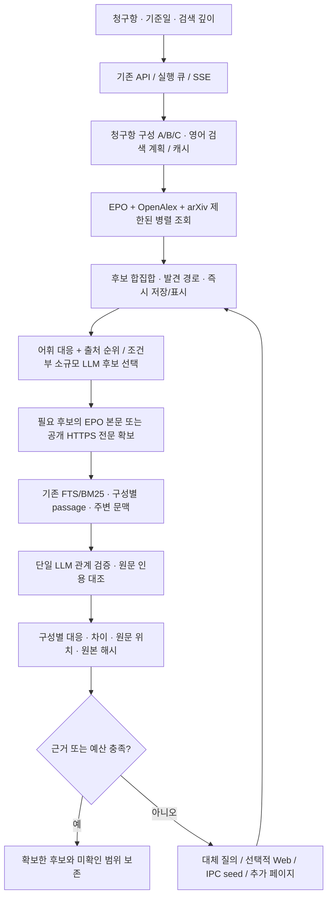

# 검색 subsystem 재구축 및 실제 연동 결과

기존 진단 후 사용자가 재구축과 라이브러리 설치를 승인한 범위의 구현 기록이다. UI·DB·실행 큐·Provider 어댑터·문헌 파서를 재사용하고, 후보 검색과 검증을 제어하는 subsystem을 교체했다. 새 경로가 기본값이며 기존 분석 기능과 과거 검색 결과를 읽는 경로는 유지한다.

## 설치와 연동

`D:/PRISM/backend/.venv`에 다음 패키지를 설치했다. 세 버전은 이미 `backend/requirements.txt`에 지정되어 있었지만 실제 가상환경에는 논문 연동 패키지가 없었다.

| 패키지 | 설치 버전 | 확인 |
| --- | --- | --- |
| pyalex | 0.21 | 실제 OpenAlex 검색 성공 |
| arxiv | 4.0.1 | 실제 arXiv 검색 및 GauHuman 조회 성공 |
| truststore | 0.10.4 | Windows 인증서 저장소를 이용한 HTTPS 전문 다운로드 성공 |

설치 직후 기존 `SearchTools` 경로에서 OpenAlex 검색 5건/1.218초, arXiv `ti:"GauHuman"` 검색 1건/0.497초를 확인했다. 단일 호출 측정이며 서비스 SLA가 아니다. 설정 상태도 OpenAlex/arXiv 모두 available로 반환한다. EPO는 저장된 기존 자격증명을 사용했으며 자격증명을 보고서나 LLM 입력에 넣지 않았다.

## 실제 구현 구조



- [engine.py](../backend/app/search_engine/engine.py): 단계·시간·조회·원문·LLM 예산 및 중단 조건을 제어한다. 검색 후보를 최종 LLM 응답과 독립적으로 보존한다.
- [sources.py](../backend/app/search_engine/sources.py): EPO/OpenAlex/arXiv를 기존 문헌 연동 어댑터로 호출한다. EPO 전문 필드 조회, OpenAlex OA 링크와 DOI 없는 문헌도 처리한다.
- [planner.py](../backend/app/search_engine/planner.py): 원문에 실제로 존재하는 구성만 수용하고 청구항 일부가 누락되면 계획을 거절한다. 원문 청구항은 보존한다.
- [ranking.py](../backend/app/search_engine/ranking.py): 구성별 어휘 대응과 RRF를 계산한다. 관련 단어가 초록 후반에 있어도 후보 선택 입력에 포함한다. 관계가 검토 구간에 없는 후보를 무조건 상위에 고정하지 않는다.
- [passages.py](../backend/app/search_engine/passages.py): 기존 로컬 검색을 재사용해 구성별 근거를 선택한다. LLM에는 제한한 passage를 전달하고 문헌·구성·인용문·위치를 코드로 대조한다.
- [job.py](../backend/app/search_engine/job.py): 기존 DB, 취소, SSE, 결과 파일, 근거 보존 정책과 연결한다. manifest v14에 engine 확장을 넣어 과거 결과와 공존한다.
- [ProgressiveSearchResults.tsx](../frontend/src/components/ProgressiveSearchResults.tsx): 구성별 근거, family 묶음, 전문 확보 상태, 질의 기록, 미검증·확보 실패를 표시한다. 유사도 백분율을 만들지 않는다.

초기 검색에는 cosine threshold나 IPC 불일치에 따른 일괄 탈락을 넣지 않았다. IPC는 확인된 seed에서 추가 후보를 찾는 분기로 사용한다. 동일 family는 알려진 family ID로 묶되 문헌별 내용과 공개일은 보존한다. arXiv 버전은 근거가 서로 다른 문헌으로 섞이지 않도록 별도로 취급한다.

## 검색 깊이와 비용 제어

| 깊이 | 기본 시간 | 질의 상한 | 후보 상한 | 원문 시도 상한 | LLM 호출 상한 | 관측 입력 토큰 예산 |
| --- | ---: | ---: | ---: | ---: | ---: | ---: |
| Fast | 45초 | 6 | 80 | 3 | 3 | 60,000 |
| Deep · 기본 | 120초 | 12 | 200 | 10 | 5 | 120,000 |
| Exhaustive | 300초 | 30 | 500 | 20 | 8 | 240,000 |

상한은 매번 전부 실행한다는 뜻이 아니다. Exhaustive도 제한된 확장 검색이며 전 세계 문헌의 완전 검색을 뜻하지 않는다.

1. 최초 API 검색으로 후보를 즉시 표시한다. 계획은 7일, API 질의는 15분 캐시하며 원본 artifact가 사라진 캐시는 사용하지 않는다.
2. 후보가 많고 검증 시간이 남아 있을 때만 작은 메타데이터 후보 선택을 실행한다. 초록은 최종 관계 증거로 취급하지 않는다.
3. 첫 검증은 최대 두 문헌을 대상으로 한다. 검증 구간은 문헌·구성별로 균등 배분하고 12,000자 이내로 제한한다. 청구항과 CLI 자체 입력은 이 12,000자와 별개다.
4. 충분한 근거를 확보하지 못한 경우, 선택한 깊이와 남은 시간에 따라 대체 검색·Web·원문 검증을 확장한다. API 후보가 있는 경우 느린 Web 호출보다 첫 원문 검증을 먼저 수행한다.
5. 단일 문헌에서 모든 구성에 명시적/의미상 대응과 실제 전문 인용을 확보하면 조기 종료할 수 있다. 기준일이 있으면 공개일 미확인 후보만으로 이 종료 조건을 충족시키지 않는다.
6. 시간·질의·문헌·LLM 예산 또는 사용자 취소에 도달하면 추가 작업을 멈추고 이미 확보한 후보를 반환한다. LLM 실패 때문에 후보 목록을 지우지 않는다.

LLM 단계의 기본 추론 강도는 low이며 사용자가 지정한 강도가 우선한다. 실제 agy CLI의 `--effort` 인자가 기존 어댑터에서 전달되지 않던 문제를 수정했다. native JSON schema는 어댑터에서 지원하지만, 실험에서 추가 출력 단계와 latency가 발생해 새 검색 경로에서는 기본 활성화하지 않았다. 대신 구조화 응답 파싱과 값·인용문 검증을 수행한다.

시간 제한은 외부 프로세스와 네트워크 취소·저장 시간 때문에 소폭 초과할 수 있다. DNS 및 PDF 파서는 별도 OS 프로세스 격리가 아니므로 악성 PDF의 CPU 사용까지 강제로 제한하는 구조는 아니다. 토큰 예산은 Provider가 보고한 사용량으로 다음 호출을 제한하며, 보고 누락과 진행 중인 호출의 사용량까지 정확하게 사전 보장하지는 못한다.

## 동일 Gaussian 청구항의 실험

정답 문헌 번호·제목을 검색 계획에 주입하지 않은 검색 실험이다. 기준일은 사용자 입력이 없어 비워 두었다. 아래 두 문헌은 부분 관련성이 알려진 비교 대상이며 신규성 결론을 의미하지 않는다.

| 실행 | 시간 | 보존 후보 | GauHuman 순위 | Wireframe 특허 순위 | 비고 |
| --- | ---: | ---: | ---: | ---: | --- |
| 기존 진단 baseline | 300.57초 | 최종 0 | 없음 | 없음 | API hit는 있었으나 최종 결과 소실·시간 초과 |
| 새 Deep 초기 통합 | 114.50초 | 40 | 5 | 없음 | 계획 cache miss, 원문 검증 시간 부족 |
| 새 Deep 검증 우선 | 100.38초 | 102 | 13 | 54 | 계획 캐시 사용, 관계 판정 완료; 인용문 검증은 아직 미흡했던 중간 버전 |
| 새 Exhaustive | 186.63초 | 158 | 3 | 70 | 계획·일부 질의 캐시, 관계 기록 22행 중 인용문 대조 19행, FULL_TEXT 3문헌 |

마지막 검색의 known-relevant Recall@20은 **1/2 = 0.5**다. 전체 후보 풀에서는 두 문헌을 모두 찾았지만, Wireframe의 낮은 순위는 아직 해결되지 않은 검색 품질 문제다. 후보 발견과 후보 재정렬의 성공을 구분한다. 초기 후보 반환은 계획 캐시가 없던 실행에서 23.94초, 캐시가 있던 실행에서 약 0.03초였으며 이를 동일 조건의 속도 향상 배수로 비교하지 않는다.

실험은 구현 과정의 여러 버전, 동일한 agy 계정의 기본 모델 설정, 변화하는 외부 index, 서로 다른 캐시 상태에서 각 1회 수행했다. 통계적 품질 개선이나 다른 기술 분야의 성능을 증명하는 결과는 아니다. 마지막 전체 검색 후에도 인용문 공백 대조, passage 균등 배분, 날짜 정규화·설정 검증을 보완했고 관련 테스트와 아래 컴포넌트 실험으로 확인했다.

### 별도 원문·관계 검증

알려진 GauHuman과 WO2025264424A1을 직접 제공한 **검증 컴포넌트 실험**도 수행했다. 이 결과를 검색 recall에 합산하지 않았다. 실제 EPO description과 arXiv v1 PDF를 확보하고, 기존 FTS로 passage를 선택해 한 번의 LLM 호출로 A/B를 비교했다.

- 마지막 호출: 원문 확보 포함 20.80초, 입력 17,923토큰, 출력 724토큰, 사용량 보고 완료.
- 동일한 저장 응답에 최신 인용문 대조를 적용하면 4행 모두 실제 원문 span으로 연결된다. 모델이 바꾼 단어는 허용하지 않고 PDF 줄바꿈·공백 차이만 원문 위치로 복원했다. 이 재대조에는 LLM을 다시 부르지 않았다.
- Wireframe A: 이웃 점으로 공분산을 만들고 SVD로 주축을 구한다. “SVD를 사용해 가우시안 공분산을 계산”과 연산 순서·출력 목적이 달라 partial로 판정했다.
- Wireframe B: 제공 passage의 거리는 에지 두께 조절용 거리 변환이다. 거리 기반 가우시안 cloning 관계가 없는 것으로 판정했다.
- GauHuman A: LBS 공분산 변환을 설명하며, 제공 passage에 이웃 위치 + SVD에 의한 공분산 산출은 없다고 판정했다.
- GauHuman B: KL divergence를 가우시안 간 거리 척도로 정의하고 positional gradient와 함께 split/clone을 제어하는 관계를 찾았다. 단순 중심점 거리와는 구별하며, “거리에 기반”을 “거리만 사용”으로 바꾸지 않는다. 모델의 semantic 판단은 이 거리 표현 해석에 의존한다.

‘absent’는 검토한 passage 범위에서 대응을 찾지 못했다는 뜻이다. 문헌 전체에 없음을 증명하지 않는다. 원문 인용의 일치는 관계 해석 자체가 반드시 맞다는 보증도 아니다.

## 비용에 관해 확인한 것과 아직 모르는 것

Deep 중간 버전의 완전한 사용량 보고는 입력 82,736 / 출력 2,036토큰이었다. Exhaustive는 관측 입력 84,188 / 출력 4,415토큰이지만 Web timeout의 누락 가능성 때문에 `usage_complete=false`다. 기존 baseline의 usage는 중간/캐시 집계 방식이 달라 새 합계와 직접 비교할 수 없다. 총 토큰·과금이 기존보다 줄었다고 주장하지 않는다.

agy에는 짧은 요청에도 약 14k 이상의 CLI 기본 입력이 관측됐다. 따라서 모델에 전달하는 전문을 passage로 줄여도 호출 횟수가 늘면 총 비용이 증가할 수 있다. 직접 통화 비용은 계정·모델 가격을 확정하지 않아 `cost_usd=null`로 남겼다. 실제 HTTP 호출 수·검색 branch·Provider token 값은 감사 기록에 남긴다.

Web seed는 유용하지만, 현재 agy 경로에서는 약 33.6초에 성공하거나 45초 제한에 걸렸다. 진단 때 다른 Web 도구가 약 1.5초에 seed를 찾았던 수치를 앱의 latency로 대입하지 않았다. 이 관측 때문에 Web을 모든 요청의 선행 필수 단계로 두지 않았다.

## 이번에 필요한 것으로 채택한 것

| 채택 | 이유 |
| --- | --- |
| 외부 API를 코드에서 호출하고 후보를 즉시 저장 | 최종 LLM 실패로 실제 API 결과가 사라지는 문제 해결 |
| 구성별 제한된 multi-query와 후보 union | 한 문장 질의에 기술 표현을 모두 AND하면 희소 문헌이 누락됨 |
| 특허·논문 병행, DOI 없는 OpenAlex 결과 보존 | 실제 연동 실패와 데이터 손실 경로 확인 |
| 전문 상태 구분, BM25 passage, 원문 인용 검증 | 초록·공통 단어만으로 관계를 확정할 수 없음 |
| 시간·호출 예산, 선택적 추가 검색 | CLI latency가 검색 성능만큼 실제 사용성을 제약 |
| 회귀용 사례·지표·단계별 로그 | 후보 발견 실패와 ranking/verification 실패를 구분해야 함 |

이번 기본 경로에는 대형 자체 특허 vector DB, 모든 feature 조합의 전수 생성, 모든 문헌에 대한 다중 LLM 검토, learned reranker, 복잡한 다중 점수 가중합을 넣지 않았다. 필요 없다고 확정한 것이 아니라 현재 자료만으로 비용·복잡성을 정당화하지 못했기 때문이다. 선택적 embedding은 기존 분석 경로에 남아 있으며 새 검색 엔진의 필수 의존성이 아니다.

## 남은 개선과 정확한 범위

1. **재정렬 개선**: Wireframe처럼 전문 질의로 발견되지만 초록에 핵심 구성이 없는 후보가 낮게 정렬된다. 전문 검색 출처 신호와 문헌 내부 희소 passage를 앞 단계 ranking에 반영하는 비교가 우선이다.
2. **평가 확대**: 현재 live gold는 Gaussian 1사례와 부분 관련 문헌 2개다. 분야·언어·날짜별 사례와 관계 hard-negative 정답을 늘리고 반복 측정해야 한다. 전역 Precision/nDCG 수치는 만들지 않았다.
3. **선택적 neural retrieval**: feature/passage embedding, cross-encoder 및 learned weights는 아직 새 경로에서 실험·채택하지 않았다.
4. **추가 source/확장**: citation graph, Unpaywall 전용 어댑터, WIPO/KIPRIS/USPTO 직접 API, family 조회 확장, 우선일의 완전한 정규화는 후속 범위다. 현재는 API가 반환한 family를 그룹화하고 원본 XML·서지 정보를 보존한다.
5. **날짜/버전**: 공개일과 확보한 최신 본문의 작성 시점은 항상 같지 않다. arXiv 식별 버전과 갱신 메타데이터는 보존하지만 모든 출처의 기준일 당시 전문까지 확정하지 않는다.
6. **실행 보안**: 직접 fetch는 공개 HTTPS/443만 허용하고 DNS 검증 IP에 TLS 연결을 고정한다. redirect 재검사, private IP 차단, 12MiB·시간·PDF 페이지/텍스트 크기 제한이 있다. 원문은 untrusted 입력이다. agy가 노출하는 native 도구 자체를 OS 수준에서 제거할 수는 없으며 예기치 않은 호출을 탐지해 중단한다. 완전한 도구 격리라고 표현하지 않는다.

## 실행·설정·되돌리기

검색 화면에서 Fast/Deep/Exhaustive와 검색 전략 프롬프트를 선택할 수 있다. 9월 17일 수정으로 기존 검색 전략의 기술적 우선순위와 문헌 A/B/C 분류 지시를 새 엔진에도 전달한다. 실행·JSON 계약은 프로그램이 관리하며, 전략 선택을 생략한 API 요청에는 설정 기본값 또는 배포본을 적용한다. 기준일은 사용자가 지정한 값만 적용한다.

새 검색은 PRISM의 fetcher가 원문을 가져오므로 agy 페이지 열람 허용 목록 설정을 표시하지 않으며, 앱 시작 시 agy 전역 허용 목록도 자동 변경하지 않는다. 기존 검색 경로를 선택했을 때만 해당 설정을 표시한다. 이미 존재하는 agy 전역 설정은 다른 작업에서도 사용할 수 있어 자동 삭제하지 않는다.

설정 API `PUT /api/settings`의 `values`로 다음 값을 변경할 수 있다. 일반 설정 UI에는 세부 예산 편집기를 추가하지 않았다.

```json
{
  "values": {
    "progressive_search_enabled": true,
    "progressive_search_web_enabled": true,
    "progressive_search_limits": {
      "deep": {"seconds": 120, "queries": 12, "pool": 200, "documents": 10, "llm_calls": 5, "input_tokens": 120000}
    }
  }
}
```

허용된 상한을 넘는 설정은 거절한다. 기존 검색 경로로 되돌리려면 `progressive_search_enabled=false`를 설정한다. 과거 DB를 변환하거나 검색 결과를 삭제하지 않는다. 기존 호환 테스트는 legacy fixture에서 기존 경로를 명시적으로 검증하고, 새 API 테스트는 기본 경로를 별도로 검증한다.

앱: `http://127.0.0.1:8765/#/search`. 다시 시작할 때는 저장소 루트에서 `./start-prism.ps1`을 실행한다.

## 검증과 재현 자료

- 전체 backend 실행: **1,328 passed / 9 skipped / 16 deselected**, 403.04초. skip에는 선택적 embedding 모델 미설치 항목이 포함되고, live CLI 테스트는 기본 수집 정책에 따라 제외된다.
- 이후 추가·수정한 검색/설정/날짜/OpenAlex 관련 선택 테스트: **72 passed**. 기존 settings 선택 테스트 **3 passed**.
- frontend: **106 passed**, TypeScript 및 production build 성공.
- 실제 서버 `/`와 `/api/health` HTTP 200 확인.

```powershell
# D:/PRISM/backend
.venv/Scripts/python.exe -m pip install -r requirements.txt
.venv/Scripts/python.exe -m pytest

# 저장된 실행을 평가: 외부 호출 없음
.venv/Scripts/python.exe scripts/evaluate_search.py --manifest PATH_TO_SEARCH_MANIFEST --output metrics.json

# 실제 외부 검색: 설정된 Provider와 API 사용량 소비
.venv/Scripts/python.exe scripts/evaluate_search.py --live --depth deep --output metrics-live.json
```

코드와 회귀 사례: [search_engine](../backend/app/search_engine/), [평가 CLI](../backend/scripts/evaluate_search.py), [Gaussian 사례](../backend/evaluation/search_cases.json).

이 PC의 원본 실험 기록:

- [진단 baseline](C:/Users/Administrator/AppData/Local/PRISM/diagnostics/20260916/baseline_summary.json)
- [Deep 실험](C:/Users/Administrator/AppData/Local/PRISM/diagnostics/rebuild-20260916/evaluation-deep-final.json)
- [Exhaustive 실험·지표](C:/Users/Administrator/AppData/Local/PRISM/diagnostics/rebuild-20260916/evaluation-exhaustive-updated-metrics.json)
- [Exhaustive 실행 원본](C:/Users/Administrator/AppData/Local/PRISM/runs/be11ec54-a186-427c-bf98-997f0593d855/engine.json)
- [별도 원문 검증](C:/Users/Administrator/AppData/Local/PRISM/diagnostics/rebuild-20260916/known-document-verification/result.json)
- [저장 응답의 최신 원문 span 재대조](C:/Users/Administrator/AppData/Local/PRISM/diagnostics/rebuild-20260916/known-document-verification/revalidated-evidence.json)
- [전체 backend JUnit 결과](C:/Users/Administrator/AppData/Local/PRISM/diagnostics/rebuild-20260916/backend-tests.xml)

실험 파일은 저장소 밖에 두었다. 관측 수치와 판단 한계를 함께 보존하며 사용자 자격증명은 문서에 포함하지 않는다.
